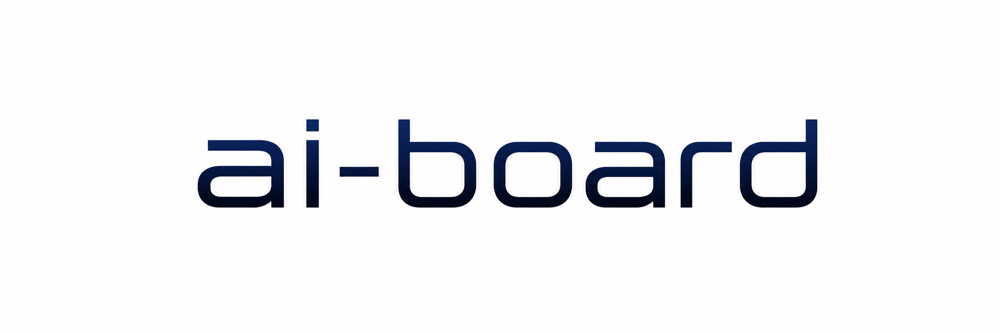

# ai-board

[English](./README_en.md) | 中文




`ai-board` 是一个给 AI 协作开发用的本地计划看板 CLI。

我做它，是因为长会话、多 agent、反复接手项目时，最容易乱的不是代码本身，而是“现在到底该做什么、谁在做、改哪些文件、做完怎么验收”。`ai-board` 把这些事情收进一个结构化文件里：`.ai-board/board.json`。Markdown 看板只是给人和 AI 阅读的生成视图。

## 它解决什么

- 新需求先入池，不再靠聊天记录临时记。
- 任务必须排期、claim、写 scope，再开始改文件。
- 多 agent 协作时，重叠 scope 默认会被阻止。
- 完成任务必须写验收结果和遗留问题，然后归档。
- `ai-board init` 会生成 AI 原生项目规范文档，让新项目一开始就有计划、状态、决策记录和开发规则。
- 一个看板可以分多条泳道，例如平台开发、课程内容、文档治理，但仍保持一个唯一真相源。

## 安装

发布到 GitHub 后，推荐把它装成用户级 CLI 工具：

```powershell
pipx install "git+https://github.com/dev-null-sec/ai-board.git"
```

如果没有 `pipx`，但有 `uv`：

```powershell
uv tool install "git+https://github.com/dev-null-sec/ai-board.git"
```

两种方式都会生成全局命令：

```powershell
ai-board --help
```

本地开发时可以在仓库根目录运行：

```powershell
uv sync
uv run python -m ai_board --help
```

## 快速开始

在任意项目根目录运行：

```powershell
ai-board init --project-name "my-project"
ai-board goal "交付第一版可用闭环"
ai-board add "补齐登录流程" --priority P1 --lane "平台开发" --source "roadmap" --acceptance "手动登录流程通过"
ai-board schedule T-0001
ai-board start T-0001 --agent codex --scope frontend/src/Login.tsx
ai-board locks
ai-board complete T-0001 --verification "手动登录流程通过" --leftovers "无"
ai-board archive T-0001
```

初始化后会生成：

```text
.ai-board/board.json
AGENTS.md
docs/开发规范.md
docs/当前状态.md
docs/决策记录.md
docs/项目方向.md
docs/页面设计.md
docs/项目路线/README.md
docs/计划看板.md
docs/归档计划看板.md
```

已有规范文档默认不会被覆盖，会生成同名 `.example`。只有确实要替换时才使用：

```powershell
ai-board init --overwrite-docs
```

## 给 AI Agent 使用

仓库里提供了一个很薄的 skill stub：

```text
skills/ai-board/SKILL.md
```

它只负责让 AI 知道什么时候该用 `ai-board`，以及如何安装 CLI。真正的使用说明由 CLI 自己提供，避免 skill 复制出去以后过期：

```powershell
ai-board skills get core
ai-board skills get core --full
```

这套设计参考了 `agent-browser` 的做法：skill 是入口，CLI 才是版本匹配的说明书和执行工具。

## 常用命令

```powershell
ai-board status
ai-board add "任务标题" --priority P1 --lane "平台开发"
ai-board schedule T-0001
ai-board start T-0001 --agent codex --scope src README.md
ai-board locks
ai-board conflicts --fail-on-conflict
ai-board complete T-0001 --verification "测试通过" --leftovers "无"
ai-board archive T-0001
ai-board render
ai-board show T-0001
```

任务生命周期：

```text
inbox -> scheduled -> active -> done -> archived
blocked -> scheduled
```

## 工作方式

`ai-board` 有几个刻意的取舍：

- `.ai-board/board.json` 是唯一写入源。
- `docs/计划看板.md` 和 `docs/归档计划看板.md` 是生成视图，不建议手改。
- 写入 board 时会使用本地 lock 文件和原子替换，避免并发写坏 JSON。
- `start` 默认阻止和 active task 重叠的 scope；确认要重叠时才用 `--force`。
- `--lane` 用来在一个看板里区分不同工作流，而不是拆出多个互相打架的看板。
- 归档里的验收结果和遗留问题要写给人看，可以带关键命令，但不要只贴命令串。

## 项目结构

```text
src/ai_board/          CLI、状态操作、渲染和初始化模板
skills/ai-board/       给 AI agent 使用的 discovery skill
tests/                 单元测试
examples/demo-project/ 示例看板输出
docs/                  本项目自己的计划、状态和决策文档
assets/                Logo 等发布素材
```

## 开发与测试

```powershell
uv run python -m unittest discover -s tests
ai-board conflicts --fail-on-conflict
```

如果你在本地开发并希望直接得到 `ai-board` 命令：

```powershell
uv tool install --editable .
```

## 当前边界

`ai-board` 不是 Jira，也不是 Web 项目管理系统。当前版本先把本地 CLI、AI 接手规则、JSON 真相源、多 agent scope 防撞和 Markdown 视图跑顺。

暂时不做：

- Web 登录系统
- 云同步和多人权限
- 自动智能排期
- 复杂依赖图调度
- OS 级文件锁

已排期但还没做完的增强包括：scope lock 的 lease 超时、续租和解锁，以及 SQLite 后端或事件日志评估。

## License

MIT License. See [LICENSE](./LICENSE).
